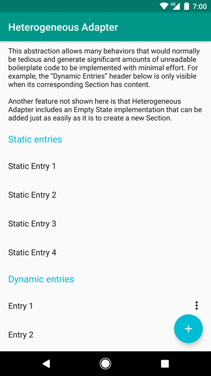

# HeterogeneousAdapter

[](https://bintray.com/marverenic/HeterogeneousAdapter/com.marverenic.heterogeneousadapter/_latestVersion)

HeterogeneousAdapter is an implementation of `RecyclerView.Adapter` designed for easily creating lists with different views for different types of data. In a regular RecyclerView Adapter, you would have to override `getItemViewType()`, `onCreateViewHolder()`, and `onBindViewHolder()` manually to deal with combined data sets. For lists that have one or two data types this is no big deal, but when several different data types need to be displayed in a single list, `onBindViewHolder` can become a tangled mess to figure out the correct indices for data in a particular collection – in particular if the list has something like headers that disappear when their corresponding section is empty.

HeterogeneousAdapter completely removes the need to override these methods. This is done by separating the data into Sections. Each Section behaves very much like a regular RecyclerView adapter, but each Section can only have one view type. Sections cannot be interwoven with each other. Heterogeneous Adapter also includes an EmptyState interface.

## Gradle Installation
```
dependencies {
    compile 'com.marverenic.heterogeneousadapter:heterogeneousadapter:1.0'
}
```

## Example
The included `sample` module contains a basic app with a list that looks like this:



In this screenshot, there are 5 visible Sections. The Activity's `onCreate()` method looks something like this:

```
mRecyclerView = (RecyclerView) findViewById(R.id.recycler_view);
HeterogeneousAdapter adapter = new HeterogeneousAdapter();

// Add intro paragraph section
adapter.addSection(new TextSection(getString(R.string.paragraph)));
// Add "static entries" subheader
adapter.addSection(new HeaderSection(getString(R.string.static_header)));
// Add static entries
adapter.addSection(new EntrySection(staticEntryList));
// Add "dynamic entries" subheader
adapter.addSection(new HeaderSection(getString(R.string.dynamic_header)));
// Add dynamic entries
adapter.addSection(new EntrySection(dynamicEntryList));

mRecyclerView.setAdapter(adapter);
```

## Enhanced ViewHolder
HeterogeneousAdapter uses a subclass of `RecyclerView.ViewHolder` with one additional method – `onUdpdate(T data, int position)`. This puts the responsibility of updating views on the ViewHolder instead of the adapter, which removes the need for an `onBindViewHolder` method in the Section class.

## Creating Sections
Each Section acts like a RecyclerView with one kind of item. Many of the methods required to implement a Section are the same from RecyclerView.Adapter. There are two basic types of Sections that are available out-of-the-box – List Sections and Singleton Sections.

### List Sections
List Sections are a generic Section designed to be used on data that is stored in a `List`. This class has one abstract method, `createViewHolder`, which behaves exactly like `RecyclerView.Adapter.createViewHolder()`. The Section holds a reference to the data items, which HeterogeneousAdapter will automatically send to the ViewHolder.

### Singleton Sections
Singleton Sections are another generic Section that contain exactly 1 data element. Like ListSection, SingletonSection contains one abstract method, `createViewHolder`. The Section holds a reference to the data item. If the data is static, then `null` can be used instead with a `Void` generic type.

## Empty States
HeterogeneousAdapter supports empty states right out of the box. Just call `heterogeneousAdapter.setEmptyState()`, and whenever there are no views to display in the RecyclerView (either because there are no sections, or all sections' sizes are 0), the empty state will be shown.

## Drag and Drop
HeterogeneousAdapter also includes another adapter that can be used to support drag and drop called `DragDropAdapter` that extends from `HeterogeneousAdapter`. Adding sections that do not support drag and drop works exactly the same as a regular HeterogeneousAdapter. Up to 1 Section in the adapter can support drag and drop. To do this, add a section that extends `ListDragSection` by calling `setDragSection()` instead of `addSection()`

## Updating RecyclerView data
When using a `ListSection`, the data in the section can be updated at any time by calling `section.setData()` (or by simply modifying the list if the app still has a reference to it). It is the user's responsibility to call `recyclerView.notifyDataSetChanged()` (or an equivalent method) whenever lists are modified in this way.

## License
Heterogeneous Adapter is distributed under an Apache 2.0 License